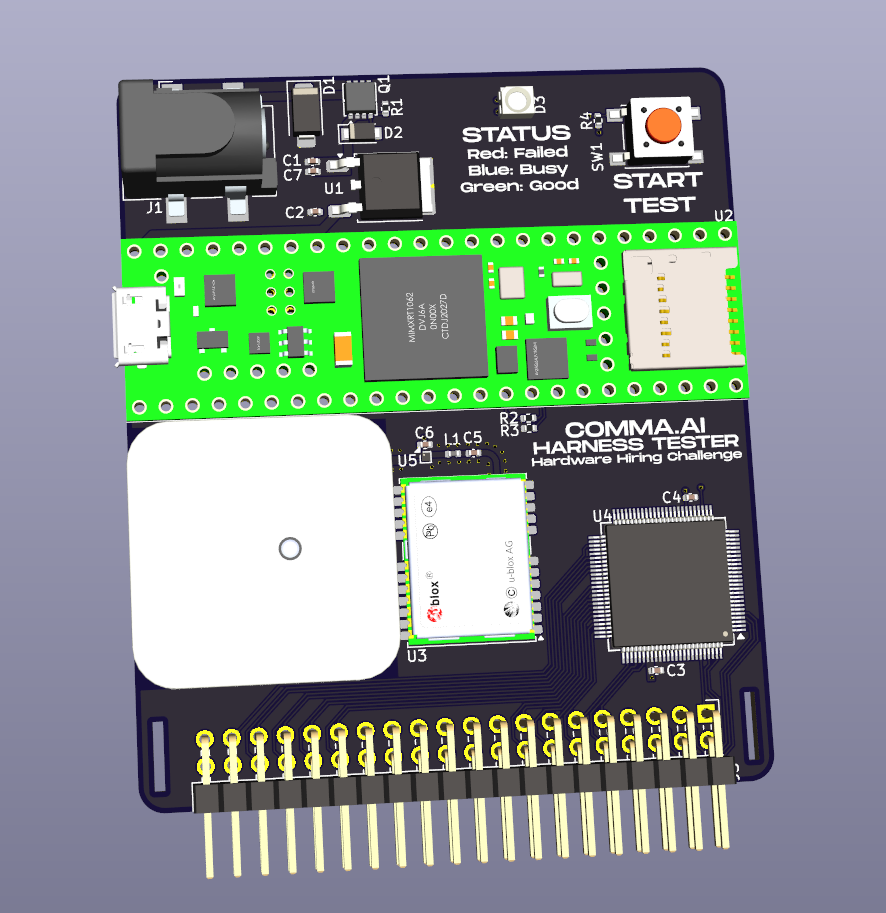

<h1>Harness Tester Challenge</h1>
<h3>
  <a href="https://comma.ai/leaderboard">Leaderboard</a>
   · 
  <a href="https://comma.ai/jobs">comma.ai/jobs</a>
   · 
  <a href="https://discord.comma.ai">Discord</a>
   · 
  <a href="https://x.com/comma_ai">X</a>
</h3>

We (mock) designed a simple harness testing PCB and wrote some firmware for it. Unfortunately, this board was designed and firmware was written on a Monday morning.

Can you figure out everything wrong with it?

## The Harness Tester
We currently sell hundreds of [car-specific harnesses](https://www.comma.ai/shop/car-harness) to users every month, consisting of close to [40 different types](https://github.com/commaai/neo/tree/master/car_harness).

As a simple wiring harness, we expect them to have a near-zero failure rate. For this, making sure that the harness wiring matches the designed diagram for each unit we send out is vital.
This tester is designed to be capable of quickly verifying which pins are connected to which other pins.

A quick list of design goals is listed here:
- 12V DC input with transient and reverse polarity protection
- compatible with harnesses with up to 40 pins (through a pin header)
- start button and RGB LED are the user interface
- microSD card to store test results along with the current time (for statistical purposes)
- receive time by acquiring a GPS lock (*ok, yes, this is just to make the board and firmware more interesting*)

## The challenge
The challenge consists of 3 distinct parts, each riddled with a few bugs:
- Schematic ([PDF](./schematic.pdf) / [Web](https://kicanvas.org/?github=https%3A%2F%2Fgithub.com%2Fcommaai%2Fharness_tester_challenge%2Fblob%2Fmaster%2Fkicad_files%2Fhardware_challenge.kicad_sch))
- PCB layout ([Gerbers](./gerbers.zip) / [Web](https://kicanvas.org/?github=https%3A%2F%2Fgithub.com%2Fcommaai%2Fharness_tester_challenge%2Fblob%2Fmaster%2Fkicad_files%2Fhardware_challenge.kicad_pcb))
- Firmware ([Source](./firmware/))

The web views are made possible thanks to [KiCanvas](https://kicanvas.org/)!

The board is designed in [KiCad 8](https://www.kicad.org/), a free and open source EDA tool. The full project is available in an [exported archive](./kicad_project.zip).

There are a handful of intentional, show-stopping bugs hidden in each part (we're not looking for potential points of improvement). Find them, and [send](https://forms.gle/US88Hg7UR6bBuW3BA) them over to us for verification!
